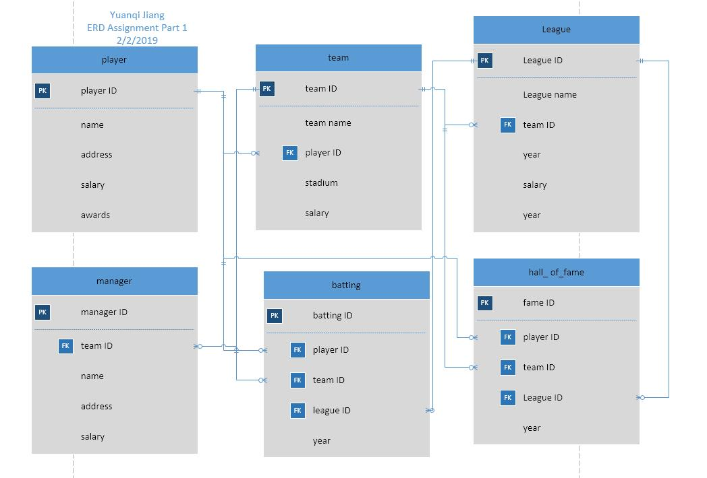
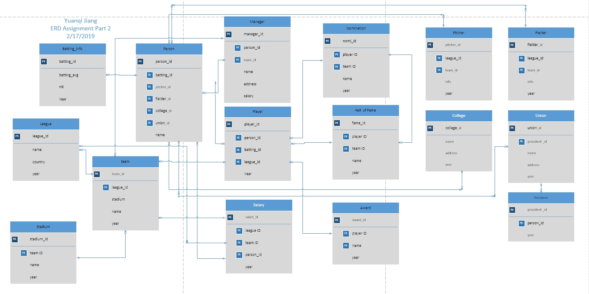

# Entity-Relationship-Diagram-IS631
<!DOCTYPE html>
<html>

  <head>
    <meta charset='utf-8' />
    <meta http-equiv="X-UA-Compatible" content="chrome=1" />
    <meta name="description" content="Home Page : My Github Web" />

    <section id="main_content" class="inner">
       
      Entity Relationship Diagram IS631    
      
      
      
      
       

  </body>
</html>
